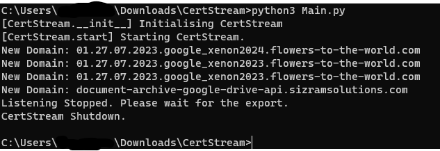

# CertStream User Guide

Welcome to CertStream! Choose a section from the table of contents below to find step-by-step guides on how to use CertStream.

--------------------------------------------------------------------------------------------------------------------

## Table of Contents

1. [Introduction to CertStream](#introduction-to-certstream)
2. [Quick Start](#quick-start)
3. [Configuration](#configuration)
3. [Feedback](#feedback)
4. [Authors](#authors)

--------------------------------------------------------------------------------------------------------------------

## Introduction to CertStream

CertStream is an easy-to-deploy Python Script designed for Cybersecurity Researchers. It seamlessly captures newly-registered domains that matches your capture regexes.

The CertStream User Guide acquaints you with the application's functionality, enabling you to maximize its potential.

Key Features:

* Retrieve domains from Certificate Transparency's vast network of monitors.
* Filters for domains of interest with one or more capture regexes.
* Stores domains of interest into a SQLite database.

> 💡 CertStream only requires one command to start. CertStream is user-friendly!

We are confident that CertStream will enhance your efficiency as Cybersecurity Researchers. Enjoy your experience with CertStream! :)

--------------------------------------------------------------------------------------------------------------------

## Quick Start

1. Download `CertStream.zip` [here](https://github.com/choonyongchan/CertStream/releases/download/v1.0/CertStream.zip), and extract `CertStream.zip` to any folder.


2. Open the `/input` folder, and edit `input_regex.txt` using any text editor.


3. Add one or more regexes for CertStream to monitor, and save the file. 

    CertStream will capture domains that matches any of the regexes.

    (e.g. The domain `google123.com` will be captured using the regexes below.)


4. Navigate back to the previous folder.


5. Open Command Prompt/Terminal on the home folder. For Windows users, follow the instructions below.

    1. Click on the address bar.

    

    3. Type `cmd`, and press `Enter` to launch Command Prompt.

    .

6. Copy each command below, and press `Enter` to start CertStream. 

    CertStream will run indefinitely.

```
python3 -m pip install -r src/requirements.txt
python3 Main.py
```


7. To stop CertStream, press CTRL+C (You may need to press a few times). 

    Domains captured is exported to an output file.

> 💡 More time is needed for export when the number of domains stored is large.



8. Open the new `/logs` folder. 


   You will find the `CertStream.txt` output file.

9. Open `CertStream.txt` to view the captured domains. 


--------------------------------------------------------------------------------------------------------------------

## Configuration

You can customise CertStream's configuration to suit your workflow.

1. Open the `/input` folder, and edit `config.yaml` using any text editor.


2. You may customise the input/output filenames and other settings. Save the file.


3. Run CertStream as usual. Refer to [Quick Start Step 4](#quick-start).

--------------------------------------------------------------------------------------------------------------------

## Feedback

CertStream is a pilot program. Any feedback is appreciated while we develop CertStream. To deposit ideas and comments, create a new Issue on Github!

--------------------------------------------------------------------------------------------------------------------

## Authors

This User Guide is written by [Choon Yong](https://github.com/choonyongchan).