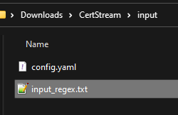

# CertStream User Guide

Welcome to CertStream! Choose a section from the table of contents below to find step-by-step guides on how to use CertStream.

--------------------------------------------------------------------------------------------------------------------

## Table of Contents

1. [Introduction to CertStream](#introduction-to-certstream)
2. [Quick Start](#quick-start)
3. [Feedback](#feedback)
4. [Authors](#authors)

--------------------------------------------------------------------------------------------------------------------

## Introduction to CertStream

CertStream is an easy-to-deploy Python Script designed for Cybersecurity Researchers. It seamlessly captures newly-registered domains that matches your capture regexes.

The CertStream User Guide acquaints you with the application's functionality, enabling you to maximize its potential.

Key Features:

* Retrieve domains from Certificate Transparency's vast network of monitors.
* Filters for domains of interest with one or more capture regexes.
* Stores domains of interest into a SQLite database.

> 💡 CertStream only requires one command to start. CertStream is user-friendly!

We are confident that CertStream will enhance your efficiency as Cybersecurity Researchers. Enjoy your experience with CertStream! :)

--------------------------------------------------------------------------------------------------------------------

## Quick Start

1. Open the `/input` folder, and edit `input_regex.txt` using any text editor.



2. Add one or more regexes, and save the file. CertStream will capture domains that matches any of these regexes.


3. Navigate back to the previous folder.

4. Open Command Prompt/Terminal on the home folder. For Windows users, follow the instructions below.

    1. Ensure you are using File Explorer (Windows' default file manager).

    2. Press `Alt` + `D` to highlight the address bar.

    

    3. Type `cmd`, and press `Enter` to launch Command Prompt on your current folder.

    .

5. [Optional, but Highly Recommended] Setup Virtual Environment to isolate CertStream from your system. [Instructions here](https://packaging.python.org/en/latest/guides/installing-using-pip-and-virtual-environments).

6. Type this command to download the necessary dependencies/libraries for CertStream, and launch CertStream. This code runs indefinitely until terminated.

```
python3 -m pip -r src/requirements.txt
python3 Main.py
```


7. To terminate CertStream, press CTRL+C once or twice. Before termination, domains stored in the database is exported to a text output file.

> 💡 More time is needed for export when the number of domains stored is large.


8. Open the `/logs` folder. 


   You will find the `CertStream.db` database file, `CertStream.log` log file, and `CertStream.txt` output file.

9. Open `CertStream.txt` to view the captured domains. 


--------------------------------------------------------------------------------------------------------------------

## Feedback
CertStream is a pilot program. Any feedback is appreciated while we develop CertStream. To deposit ideas and comments, create a new Issue on Github!

--------------------------------------------------------------------------------------------------------------------

## Authors

This User Guide is written by [Choon Yong](https://github.com/choonyongchan).