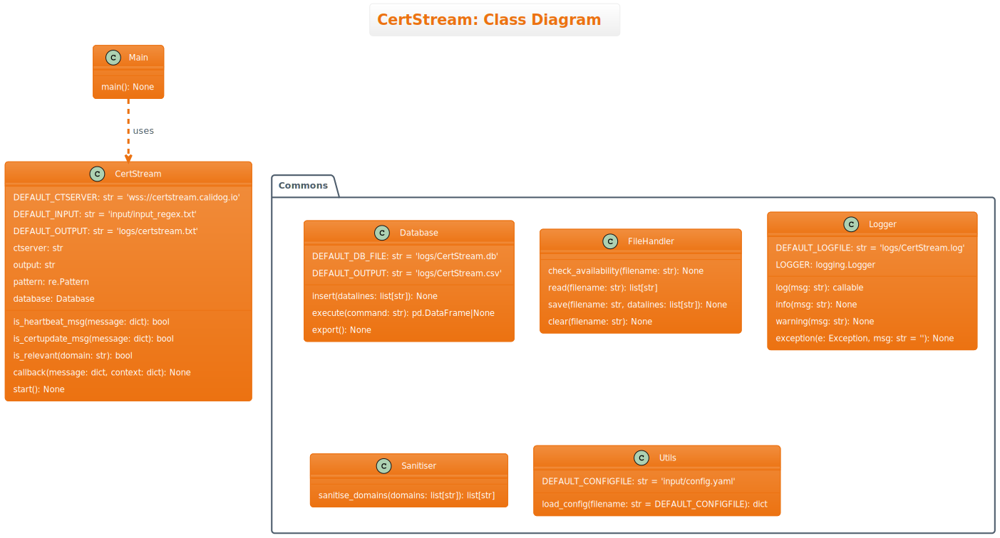
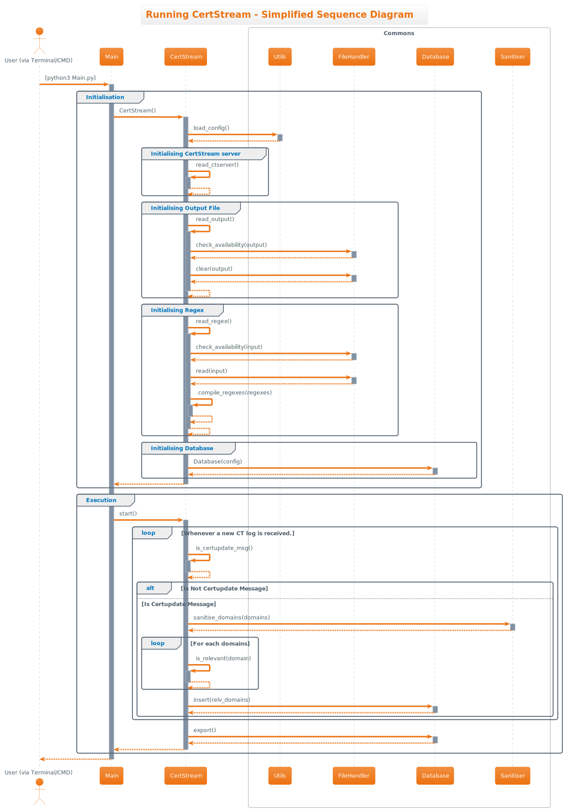

# CertStream Developer Guide

Welcome to CertStream! Choose a section from the table of contents below to find the details on how CertStream works!

--------------------------------------------------------------------------------------------------------------------

## Table of Contents

1. [Introduction to CertStream](#introduction-to-certstream)
2. [Setting up & Getting started](#setting-up--getting-started)
3. [Design](#design)
    1. [Architecture](#architecture)
    2. [CertStream component](#certstream-component)
    3. [Common classes](#common-classes)
4. [Implementation of Features](#implementation-of-features)
    1. [Running CertStream](#running-certstream-python3-mainpy)
5. [Feedback](#feedback)
6. [Authors](#authors)

--------------------------------------------------------------------------------------------------------------------

## **Introduction to Certstream**

CertStream is an easy-to-deploy Python Script designed for Cybersecurity Researchers. It seamlessly captures newly-registered domains that matches your capture regexes.

The CertStream User Guide acquaints you with the application's functionality, enabling you to maximize its potential.

Key Features:

* Retrieve domains from Certificate Transparency's vast network of monitors.
* Filters for domains of interest with one or more capture regexes.
* Stores domains of interest into a SQLite database.

> 💡 CertStream only requires one command to start. CertStream is user-friendly!

We are confident that CertStream will enhance your efficiency as Cybersecurity Researchers. Enjoy your experience with CertStream! :)

--------------------------------------------------------------------------------------------------------------------

## **Setting up & Getting started**

Refer to the [User Guide](../README.md).

--------------------------------------------------------------------------------------------------------------------

## **Design**

### Architecture

Given below is a quick overview of main components and how they interact with each other.

**Main components of the architecture**

At DomainChecker launch, **`Main`** calls [**`CertStream`**](#logic-component) to listen for Certificate Transparency logs.

[**`Commons`**](#common-classes) represents a collection of classes used by multiple other components.

**How the architecture components interact with each other**

The *Class Diagram* below shows how the components are structured.

<!---
@startuml
!theme aws-orange

title CertStream: Class Diagram

class Main {
  main(): None
}

class CertStream {
  <u>DEFAULT_CTSERVER: str = 'wss://certstream.calidog.io'</u>
  <u>DEFAULT_INPUT: str = 'input/input_regex.txt'</u>
  <u>DEFAULT_OUTPUT: str = 'logs/certstream.txt'</u>
  ctserver: str
  output: str
  pattern: re.Pattern
  database: Database
  
  is_heartbeat_msg(message: dict): bool
  is_certupdate_msg(message: dict): bool
  is_relevant(domain: str): bool
  callback(message: dict, context: dict): None
  start(): None
}

package Commons {
  class Database {
    <u>DEFAULT_DB_FILE: str = 'logs/CertStream.db'</u>
    <u>DEFAULT_OUTPUT: str = 'logs/CertStream.csv'</u>
    insert(datalines: list[str]): None
    execute(command: str): pd.DataFrame|None
    export(): None
  } 
  class FileHandler {
    <u>check_availability(filename: str): None</u>
    <u>read(filename: str): list[str]</u>
    <u>save(filename: str, datalines: list[str]): None</u>
    <u>clear(filename: str): None</u>
  }
  class Logger {
    <u>DEFAULT_LOGFILE: str = 'logs/CertStream.log'</u>
    <u>LOGGER: logging.Logger</u>
    
    <u>log(msg: str): callable</u>
    <u>info(msg: str): None</u>
    <u>warning(msg: str): None</u>
    <u>exception(e: Exception, msg: str = ''): None</u>
  }
  class Sanitiser {
    <u>sanitise_domains(domains: list[str]): list[str]</u>
  }
  class Utils {
    <u>DEFAULT_CONFIGFILE: str = 'input/config.yaml'</u>
    <u>load_config(filename: str = DEFAULT_CONFIGFILE): dict</u>
  }
}

Main .down.> CertStream: uses
CertStream .right[hidden].> Commons

@enduml
-->

The sections below give more details of each component.

### CertStream component

**API**: [`CertStream.py`](../src/CertStream.py)

The CertStream component handles CertStream operations. 

The CertStream component:

* uses Long Polling to listen for updates from Certificate Transparent monitor network (aggregated by Calidog's CertStream).
* logs each relevant domain and stores them in a SQLite database.

#### Design Considerations

**Database: Why not use Text File as a simple datastore?**

* **Alternative 1 (current choice):** Use a well-implemented database (i.e. SQL database).
    * Pros: Reliable, follows ACID principles. Provides additional features like disallowing duplicates. 
    * Cons: Additional overhead and performance cost.

* **Alternative 2:** Use a simple Text/CSV file.
    * Pros: Simple implementation, fewer bugs and higher performance.
    * Cons: Hard to manage data once it is written into the Text/CSV file. Less flexible, unless auxillary code is written.

### Common classes

**API** : [`Commons.py`](../src/Commons.py)

Classes used by multiple components are in the `Commons` package.

--------------------------------------------------------------------------------------------------------------------

## **Implementation of Features**

This section describes some noteworthy details on how certain features are implemented.

### Running CertStream `python3 Main.py`

#### Implementation

The execution of CertStream is facilitated by `Main`. `Main` sets up the runtime environment (specifically: Change runtime working directory & Initialise logging) & initialises `CertStream`.

#### Behaviour

Given below is a scenario of how running Main.py behaves at each step.

Step 1. The user first launches CertStream by executing `python3 Main.py` on the Terminal/Command Prompt.

Step 2. `Main` calibrates the working directory to the directory where `Main.py` is located, and initialises `CertStream`

Step 3. `Facade` grabs the configuration fields from the configuration file (default: `config.yaml`), and initialises the Certificate Transparency monitor server, output filename, regexes to monitor and `Database`.

Step 4. `Main` starts Long Polling, by calling `certstream.start()`.

Step 5. For each new CT log, `certstream.callback()` is called. It first verifies if the log received is a Certificate Update message. Then, it sanitises the domains, filters for relevant domains and insert these domains into the database.

Step 6. When the user terminates CertStream (e.g. `CTRL`+`C`), `certstream.start()` will export all stored domains in the database to an output text file. Finally, the program terminates.

The following sequence diagram shows how the CertStream runs:

<!---
@startuml
!theme aws-orange

skin rose

title "Running CertStream - Simplified Sequence Diagram"

actor "User (via Terminal/CMD)" as User
participant Main
participant CertStream
box Commons
participant Utils
participant FileHandler
participant Database
participant Sanitiser
end box

User -> Main++: [python3 Main.py]

group Initialisation
Main -> CertStream++: CertStream()
CertStream -> Utils++: load_config()
return
group Initialising CertStream server
CertStream -> CertStream++: read_ctserver()
return
end group
group Initialising Output File
CertStream -> CertStream++: read_output()
CertStream -> FileHandler++: check_availability(output)
return
CertStream -> FileHandler++: clear(output)
return
return
end group
group Initialising Regex
CertStream -> CertStream++: read_regex()
CertStream -> FileHandler++: check_availability(input)
return
CertStream -> FileHandler++: read(input)
return
CertStream -> CertStream++: compile_regexes(regexes)
return
return
end group
group Initialising Database
CertStream -> Database++: Database(config)
return
end group
return
end group

group Execution
Main -> CertStream++: start()
loop Whenever a new CT log is received.
CertStream -> CertStream++: is_certupdate_msg()
return
alt Is Not Certupdate Message
else Is Certupdate Message
CertStream -> Sanitiser++: sanitise_domains(domains)
return
loop For each domains
CertStream -> CertStream++: is_relevant(domain)
return
end
CertStream -> Database++: insert(relv_domains)
return
end loop
end group
CertStream -> Database++: export()
return
return
end group
return

@enduml
-->

--------------------------------------------------------------------------------------------------------------------

## Feedback
CertStream is a pilot program. Any feedback is appreciated while we develop CertStream. To deposit ideas and comments, create a new Issue on Github!

--------------------------------------------------------------------------------------------------------------------

## Authors

This User Guide is written by [Choon Yong](https://github.com/choonyongchan).